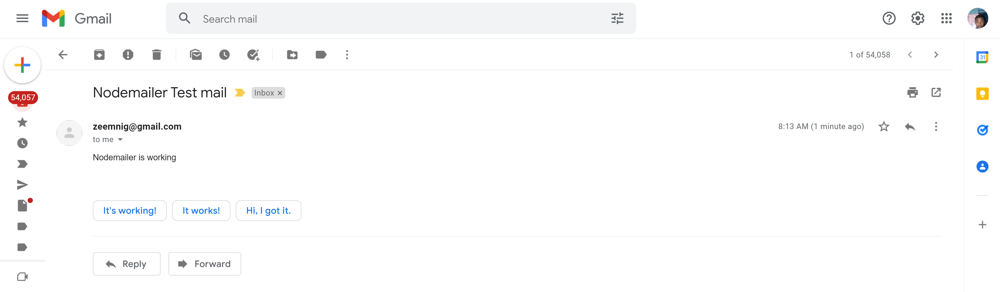

# emailsender

It sends automated email from your gmail account to another email address

You will need to get Client ID, Secret Key and Refresh Token from google cloud platform for it to work properly.

Install Dotenv package ie npm install dotenv 
include your environment variables and input all details.

below is a screenshot of an automated email.

